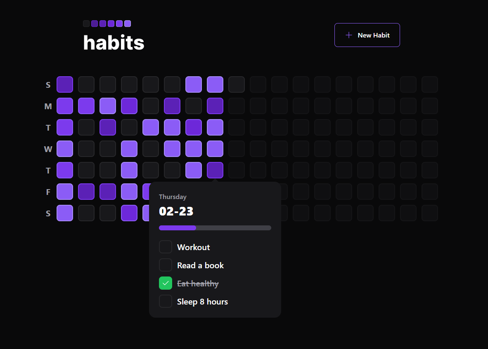
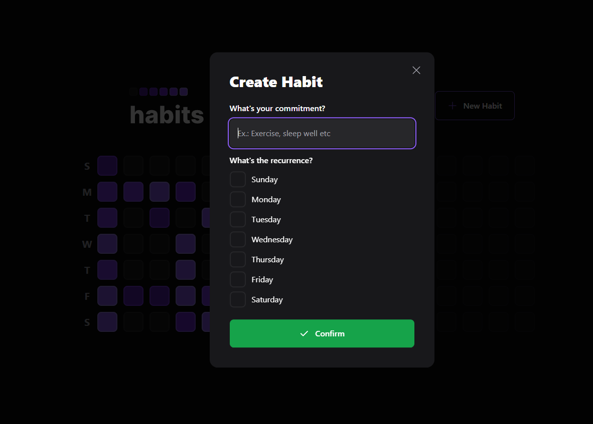

<h1 align="center">
  
   
  
  
   
</h1>

> :calendar: App designed to help create and track your daily habits

  <a href="#dependencies">Dependencies</a>&nbsp;&nbsp;&nbsp;|&nbsp;&nbsp;&nbsp;
  <a href="#back-end">Back-End</a>&nbsp;&nbsp;&nbsp;|&nbsp;&nbsp;&nbsp;
  <a href="#front-end">Front-End</a>&nbsp;&nbsp;&nbsp;|&nbsp;&nbsp;&nbsp;
  <a href="#web-preview">Preview</a>

## Dependencies
- [Node.js](https://nodejs.org/en/) (8.x or higher)

## Back-End
REST API developed using Node.js

- :green_book: **Node.js** — Cross-platform runtime environment for building server-side applications
- :diamond_shape_with_a_dot_inside: **TypeScript** — Strongly typed and object-oriented programming language
- :zap: **Fastify** — Web Framework for Node.js
- :mount_fuji: **Prisma** - ORM to query and manipulate data from the database
- :clipboard: **Zod** - Library for data declaration and validation
- :sunny: **Dayjs** - Library to handle dates
- 📝 **ESLint/Prettier** — Code formatting tools

### Back-end Installation
1. Clone the repository  
`$ git clone https://github.com/renatomarquesteles/nlw-setup.git`
2. Access the server directory  
`$ cd nlw-setup/server`
3. Install the dependencies  
`$ npm i`
4. Run the migrations to create the tables in the database  
`npx prisma migrate dev`
5. Run the API  
`$ npm run dev`

## Front-End
Web user interface application developed using React

- :globe_with_meridians: **React** — Library for building user interfaces
- :diamond_shape_with_a_dot_inside: **TypeScript** — Strongly typed and object-oriented programming language
- :zap: **Vitejs** — Development environment setup tool
- :computer: **Axios** — HTTP Client to connect with the API
- :loop: **React Router DOM** - Routing and navigation for React components
- :registered: **Radix UI** — Components library for React
- :leaves: **Tailwind CSS** — CSS framework for React
- :heart_eyes: **Phosphor Icons** — Icons library for React
- 📝 **ESLint/Prettier** — Code formatting tools

### Front-end Installation

_Before running the front-end app make sure that the server is running too!_

1. Access the web directory  
`$ cd nlw-setup/web`
2. Install the dependencies  
`$ npm i`
3. Run the application  
`$ npm run dev`

## Web Preview

  
  

